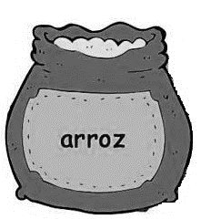
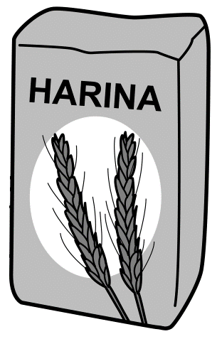

# Razón

Una razón es una comparación multiplicativa de dos o más cantidades o medida.

>La razón entre $a$ y $b$ cuando $b$ es una cantidad distinta de cero, se escribe: 
$\frac{a}{b}$ o $a:b$ y se lee $a$ es a $b$.

Véase también [@huircan2013guia].

Esta relación nos da cuántas veces una cantidad es igual a la otra cantidad, como 6 estudiantes por 1 profesor o 2 tazas de azúcar para 5 tazas de harina. Independientemente de la situación, las comparaciones de razones siempre se relacionan de forma multiplicativa. Por ejemplo, la razón de 6 estudiantes por 2 profesores es que hay 3 veces más estudiantes que profesores.  También se  puede describir esta relación de varias formas, tales como:

* 3 estudiantes por cada profesor.
* Un profesor por cada 3 estudiantes. 
* El número de profesores es $\frac{1}{3}$ del número de estudiantes. 

Independientemente de la forma en que se comunique esta relación, debe ser claro que hay 3 veces más estudiantes que profesores.

Cabe mencionar que, como lo afiman [@petit2020focus] la razón puede tener dos interpretaciones. La primera es por
unir o componer dos cantidades de una manera que "conserva una relación multiplicativa", es decir, un cierto número de una cantidad junto con un cierto número de otra cantidad crea un compuesto unidad [@beckmann2017mathematics]. Por ejemplo,

{width=30px} {width=30px} {width=30px} {width=28px} 

1. La relación de cuadros blancos a cuadros negros es $\frac{1}{3}$ ó $1:3$.


```{r, echo=FALSE, out.width='5%'}
knitr::include_graphics(rep('ProtectoR/estumate.png',7))
knitr::include_graphics(rep('ProtectoR/estuesta.png',3))
```

2. La relación de estudiantes de matemáticas a estudiantes de estadística es   $\frac{7}{3}$ ó $7:3$.


{width=50px} {width=40px}{width=40px}

Imágenes tomadas de @BibEntry2021Marzo y @BibEntry2019Mar.

3. La relación entre libras de arroz a kilos de harina es $\frac{1}{2}$ ó $1:2$.


Observemos que libras de arroz y kilos de lentejas son cantidades de medidas diferentes mientras que en el anterior, las cantidades solo eran estudiantes. Esto nos dice que las cantidades que componen una unidad compuesta pueden ser las mismas o diferentes.

La segunda interpretación consiste en  comparar multiplicativamente dos cantidades. Por ejemplo, en una situación cotidiana en el que estamos comparando el precio de dos artículos, es conveniente notar cual es el artículo más costoso, de lo que lleva a decir: “el artículo 1 es $n$ veces más costoso que el artículo 2”, o también es válido decir: “el artículo 2 vale $\$5000$ más que el artículo 1. Sin embargo, la relación que ocurre es en términos multiplicativos contra aditivos. Por tanto, la primera expresión, la cual es dada en términos multiplicativos, es un ejemplo de razón como comparación multiplicativa. 

Precisamos advertir que la razón no es una fracción en el sentido matemático, la confusión puede deberse al hecho de que una de las notaciones para la razón, $\frac{a}{b}$ donde $b\neq 0$, comparte la misma forma con una fracción. Ilustremos mejor mediante el siguiente ejemplo: 
En el primer parcial, Ana acierta en $3$ preguntas y desacierta en $10$ preguntas. Después en el segundo parcial responde bien $5$ y desacierta en $7$ preguntas . ¿Cuál es la razón de las preguntas acertadas con las desaciertas en los dos parciales? 

Número de preguntas acertadas: 
$\frac{6 \hspace{2mm} aciertos}{10 \hspace{2mm} desaciertos}+\frac{4\hspace{2mm} aciertos}{7\hspace{2mm} desaciertos}=\frac{10 \hspace{2mm} aciertos}{17 \hspace{2mm} desaciertos}$.

Con lo que $10$ aciertos es a $17$ desaciertos.

Pero  Ana siempre llega $\frac{3}{4}$ de hora tarde a las clases los martes  y $\frac{5}{8}$ de hora tarde para clases los jueves. ¿Cuántas horas en total llega Ana tarde a las clases los martes y jueves?

Número de horas  que llegar tarde:
$\frac{3}{4}hora+\frac{5}{8}hora=\frac{11}{8}hora$

Para concluir, tenemos que el primer contexto es un ejemplo de una situación de razón, y el segundo contexto es un ejemplo de una situación de fracción. Notemos que el primer ejemplo involucra cuatro cantidades: $6$ aciertos es a $10$ desaciertos y $4$ aciertos es a $7$ desaciertos en el segundo parcial. En contraste, el segundo ejemplo involucra sólo dos cantidades: $\frac{3}{4}$ de hora y $\frac{5}{8}$ de hora.

Por otro lado, cuando nos referimos a $10 km/h$ realmente estamos comparando dos cantidades distintas, y se traduce como *por cada hora se recorre 10 kilómetros* o también la relación entre kilometros y segundos es 
$$\begin{equation}
\frac{10}{1}, \hspace{5mm} 10:1
\end{equation}$$
lo que nos dice es una razón. Estos tipos de razones que involucran un periodo de tiempo los llamaremos [*tasas*](#tasas).
