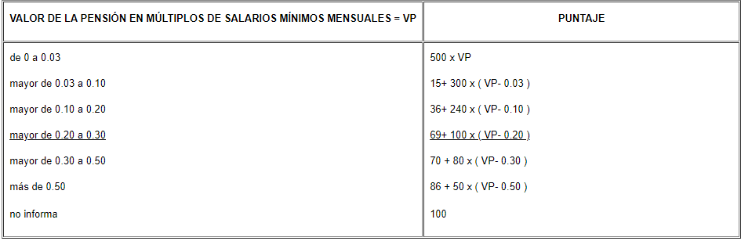
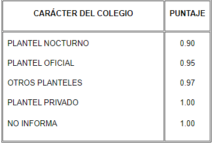
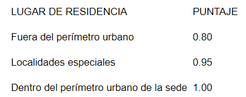
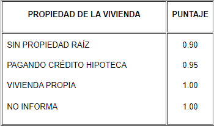
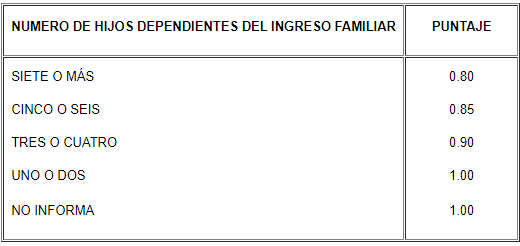

# Índice {#pbm}

Un índice es una estadística compuesta, es decir, es basada en múltiples elementos de datos, en otras palabras, un índice es una medida compuesta que agrega múltiples indicadores. Según @ContributorstoWikimediaprojects2020Nov, los índices, también conocidos como *indicadores compuestos*, resumen y clasifican observaciones específicas, generalmente en la escala ordinal.

**La escala ordinal**
tiene como caracteristica que sus categorías están ordenadas por rango; cada clase posee una misma relación posicional con la siguiente; es decir, la escala muestra situaciones escalonadas. Si se usan números, su única significación está en indicar la posición de las distintas categorías en la serie; sin embargo, no asumen que la distancia del primer escalón al segundo sea la misma que la del segundo al tercero.

>***Puntaje Básico de Matrícula PBM***.
>Es el indicador que utiliza la Universidad Nacional de Colombia para hacer la
clasificación socioeconómica del estudiante y asignar la matrícula. Según la Resolución 2146 DE 1993 [@BibEntry2021Maria]. El Puntaje Básico de Matrícula PBM, es calculado con la información de 7 variables, cuyo
soporte documental es aportado por el estudiante. A cada variable se le asigna un puntaje, un peso ponderado y una función específica dentro de la fórmula, el cual es calculado mediante la siguiente fórmula 
$$\begin{equation}
PBM=(0,4A_1+0,3A_2+0,3A_3)\times B_1 \times B_2 \times B_3 \times B_4.
\end{equation}$$
donde las variables $A_2$ y $A_1$ constituyen al estrato  y el valor pensión escolar en el último año de secundaria respectivamente y son indicadores del nivel de gastos en el hogar, mientras $A_3$ representa el nivel de ingresos. Las variables $B_1$ es tipo de colegio, $B_2$ es el lugar de residencia, $B_3$ propiedad de la vivienda familiar y número de hijos dependientes del ingreso del hogar es $B_4$ y son igualmente, indicadores del nivel de gastos.


```{r estrato, echo=FALSE}
ind5 <- data.frame(`Estrato` = c(1,2,3,4,5,6,"NO INFORMA"), `Puntaje`=c(00,13,30,55,80,100,100))
knitr::kable(ind5, caption = 'Ejemplo de escala ordinal usando la variable estrato $A_2$' )
```


La OCDE, la Organización para la Cooperación y el Desarrollo Económicos [@BibEntry2020Dec] y el Centro Común de Investigación de la Comisión Europea [@BibEntry2015Jun] publicaron conjuntamente un manual para la construcción de indicadores compuestos en 2008. El manual, respaldado oficialmente por el comité estadístico de alto nivel de la OCDE, describe diez pasos recurrentes para la elaboración de un índice: 

+ Paso 1: Marco teórico

+ Paso 2: Selección de datos

+ Paso 3: Imputación de datos faltantes

+ Paso 4: Análisis multivariado

+ Paso 5: Normalización

+ Paso 6: Ponderación

+ Paso 7: Agregación de indicadores

+ Paso 8: Análisis de sensibilidad

+ Paso 9: Vincular a otras medidas

+ Paso 10: Visualización

Como sugiere la lista, es laborioso construir un indicador compuesto, lo que hace que su uso sea cuestionable. 

En el funcionamiento, el índice presenta diferentes caracteristicas cuando va enfocado en las ciencias sociales o en la economía, por esta razón, haremos un comparativo por separado que nos permita identificar como actúan en estos dos campos. 

## Índice en la economía

>Es un indicador que tiene por objeto medir las variaciones de un fenómeno económico o de otro orden referido a un valor que se toma como base en un momento dado.

Cuando el índice va referido a un valor de un producto será conveniente referirse al [*número índice*](#numeroindice).

### Número índice {#numeroindice}

Es una cifra de datos económicos que refleja el precio o la cantidad en comparación con un valor estándar o base. Particularmente, el número índice recoge la evolución relativa en el período $t$ de una magnitud económica (precios, producciones, …) de un conjunto de bienes o productos respecto al período base ó de referencia 0 [@fernandez2004introduccion]. Los números índices se utilizan especialmente para comparar la actividad empresarial, el costo de vida y el empleo.  

Al período inicial se le denomina período base o referencia y se le asigna el valor $100$ y se compara con el período actual o también llamado corriente.  Así, definimos a $I_{0}^{t}$ como el número índice de un determinado valor en el período $t$, respecto al período base $0$.

Si la comparación se realiza para valores de una sola magnitud, hablaremos  de *números índices simples*, en caso contrario, cuando se trabaja con más de dos magnitudes a la vez, hablaremos de *números índices compuestos*. Por simplicidad es muy común denominar al número índice simple (o complejo) por solo [índice simple](#indicesimple)  (o [complejo](#indicecomplejo)) y aquí no será la excepción.

#### Índice simple {#indicesimple}
Se denominada *índice simple* de la magnitud $X$ en el período $t$ respecto al período $0$, a la razón, 

$$\begin{equation}
I_{0/t}=\frac{x_t}{x_0}\times 100
\end{equation}$$

donde $x_t$ representa el valor de bien en el período $t$ y $x_0$ el valor del bien en el período $0$. 

**Ejemplo.** ***Presupuesto de los ingresos totales de la Universidad Nacional, vigencias 2008 a 2017 (pesos constantes a 2017, cifras en millones de pesos).***

|*Año* |2008|2009|2010|2011|2012|2013|
|----------|--------|---------|-----------|----------|----------|----------|
|*Total Presupuesto UN*|1.479.526|1.572.523|1.649.495|1.604.608|1.720.856|1.838.882|
$I_{año/2008}$ | 100|106,28|104,89|97,27|107,24|106,85|

$I_{2009/2008}=\frac{1.572.523}{1.479.526}\times 100=106,28$, lo que significa que el presupuesto de los ingresos totales en el año 2009 aumentó un $6,28\%$ con respecto al año 2008.

Según @perez2010nociones, sería deseable que todo numero índice satisfaciera las siguientes propiedades:

|Propiedades|
|--------------------------------------------------------|
|***1. Existencia:*** Un número índice debe ser un número determinado y no nulo. |
|***2. Identidad:*** Cuando coincide el período base y el período actual, el indicador tomará un valor unitario (o 100 si se expresa en porcentaje).$$I_{t/t}=\frac{x_t}{x_t}=1$$|
|***3. Homogeneidad:*** El valor del índice no se altera si se produce un cambio en las unidades de medida. |
|***4. Inversión:***El índice con los períodos invertidos resulta la inversa del índice.$$I_{t/0}=\frac{x_t}{x_0}=\frac{1}{\frac{x_0}{x_t}}=\frac{1}{I_{0/t}}\Longrightarrow I_{t/0}I_{0/t}=I_{t/t}=1$$| 
|***5. Proporcionalidad:*** Si se produce una variación proporcional en todas las magnitudes, el índice variará en la misma proporción. |

Lo índices simples satisfacen estas cinco propiedades, pero no siempre se cumple para índices complejos. 

Por tanto, lo que nos interesa ahora, es encontrar una clasificación para identificar mejor los índices simples. Pues bien, dentro de la estadística económica, los índices simples se clasifican como: *Índice de precios, cantidades y valores.*

***a). Índice de precios:*** Refleja la variación de los precios de un conjunto de artículos entre dos momentos de tiempo o dos puntos en el espacio. Su fórmula de cálculo consiste en 

 $$\begin{equation}
P_{t/0}=\frac{p_{t}}{p_{0}}\times 100
\end{equation}$$

 donde $p_{t}$ indica el valor del precio de un producto en un período $t$ y $p_{0}$ el precio del producto en el período base. 
 
**Ejemplo: Precio de una libra de arroz en una población desde el año 2012 a 2015.**

|*Año* |2012|2013|2014|2015|
|----------|--------|---------|-----------|----------|----------|
|*Precio del arroz (pesos)*|700|850|910|1.050|
|$I_{año/2012}$($\%$)|$100$|$\frac{850}{700}\times 100=121,4$|$\frac{910}{850}\times 100=107$|$\frac{1.050}{910}\times 100=115,3$|


***b). Índice de cantidad:*** Consiste en comparar las cantidades (o volúmenes) de producción, consumo o exportación. 
De igual manera, si $q_{t}$ indica la cantidad de un articulo producido o vendido en el período $t$ dado y $q_{0}$ la cantidad en el periodo base, la fórmula general para el índice simple de cantidad es:

 $$\begin{equation}
Q_{t/0}=\frac{q_{t}}{q_{0}}\times 100.
\end{equation}$$

**Ejemplo: Consumo de una libra de arroz en una población desde el año 2012 a 2015.**

Continuando con el estudio del arroz, supongamos que obtenemos los siguientes datos.  

|*Año* |2012|2013|2014|2015|
|----------|--------|---------|-----------|----------|----------|
|*Consumo (kg)*|39,62|40,21|41,60|39,20|
|$I_{año/2012}$($\%$)|$100$|$\frac{40,21}{39,62}\times 100=101,48$|$\frac{41,60}{40,21}\times 100=103,45$|$\frac{39,20}{41,60}\times 100=94,23$|

***c). Índice de valores:*** Se define como la razón entre el valor de cierto producto en el período actual, y el valor del mismo en el período base, donde el valor de un bien en un período es el producto del precio de ese bien por el consumo del producto.

  $$\begin{equation}
V_{t/0}=\frac{q_{t}p_{t}}{q_{0}p_{0}}\times 100.
\end{equation}$$

**Ejemplo: Valor de una libra de arroz en una población desde el año 2012 a 2015.**

Teniendo en cuenta las tablas anteriores, podemos calcular el índice de valores del arroz aplicando la fórmula de cálculo. En particular, para el año 2013 se obtiene que el índice de valor es, 
$\frac{(850)(40,21)}{(700)(39,62)}\times 100=123.23$
y así, se obtiene el resto de valores.

|*Año* |2012|2013|2014|2015|
|----------|--------|---------|-----------|----------|----------|
|$I_{año/2012}$($\%$)|100|123,2|110,7|108,7|

#### Índice complejo {#indicecomplejo}

Como expresa @lorenzo2007estadistica, hablaremos de *índices complejos* cuando se forman a partir de los índices simples. Su función principal será sintetizar o resumir la información que proporcionan los índices simples que entran en su composición.

Supongamos ahora que se observa la evolución de variables $X_1,X_2,\cdots, X_n$ a lo largo de una sucesión de "años" $t=0,1,2,\cdots,T$ cuya descripción es la siguiente: 

    
$$
\begin{equation}
\begin{bmatrix}
  \textbf{Años} & \mathbf{X_1} & \mathbf{X_2} & \mathbf{X_3} &\cdots & \mathbf{X_n}\\
     \mathbf{0}& x_{10} & x_{20} & x_{30} & \cdots & x_{n0}\\
    \mathbf{1} & x_{11} & x_{21} & x_{21} & \cdots & x_{n1}\\
     \vdots & \ddots & \ddots & \ddots & \cdots & \vdots\\
     \mathbf{T} & x_{1T} & X_{2T} & X_{3T} & \cdots & X_{nT}
    \end{bmatrix}
\end{equation}
$$

donde $x_{ij}$ denota el valor que la variable $X_i$ toma en el período $j$. Ahora, con lo anterior podemos obtener las siguientes series de índices simples con una base año 0: 

$$
\begin{equation}
\begin{bmatrix}
  \textbf{Años} & \mathbf{X_1} & \mathbf{X_2} & \mathbf{X_3} &\cdots & \mathbf{X_n}\\
     \mathbf{0}& I_{00}^{1} & I_{00}^{2} & I_{00}^{3} & \cdots & I_{00}^{n}\\
    \mathbf{1} & I_{10}^{1} & I_{10}^{2} & I_{10}^{3} & \cdots & I_{10}^{n}\\
     \vdots & \ddots & \ddots & \ddots & \cdots & \vdots\\
     \mathbf{T} & I_{T0}^{1} & I_{T0}^{2} & I_{T0}^{3} & \cdots & I_{T0}^{n}
    \end{bmatrix}
\end{equation}
$$

donde $I_{t0}^{i}=\frac{x_{it}}{x_{i0}}$ es el índice simple de la $i$-ésima variable correspondiente al año $t$ con base el año 0.

De lo anteriormente expuesto, debemos tener en cuenta si las magnitudes de cada uno de los índices simples que conforman los índices complejos tienen la misma importancia o de lo contrario, unas son más relevantes que otras. En otros términos, por ejemplo, para medir la evolución de los precios de los bienes de consumo en un país determinado, habrá que dar mas importancia a la evolución de los precios de la alimentación que los de las medicinas, ya que el gasto de alimentación es mayor que el gasto en medicinas. Otro ejemplo, en el sector industrial, el índice salarial se elabora a partir de los índices salariales de cada una de las empresas que integran el sector, resulta evidente que habrá que ponderar más los índices correspondientes a las empresas con más trabajadores. 

Por lo tanto, según @arroyo2006manual procede distinguir dos tipos de índices complejos:

* Índice complejo **no ponderado**, que dan igual importancia a cada magnitud del índice. 

* Índice complejo **ponderado**, cuando se tiene en cuenta la distinta importancia que tiene cada magnitud en el conjunto de ellas y para cada $X_i$ viene indicada por un peso o ponderación $w_i$. 

Ilustraremos ahora los dos tipos de índices mediante la media aritmética o promedio, la cual es la más conocida y usada para el análisis de los datos.

**Índice complejo no ponderado** 

***a. Media aritmética de índices simples:***

$$ \overline{I}_{t/0}=\frac{1}{N}\sum^{N}_{i=1}I_{t0}^{i} $$
donde $N$ es el número de elementos de cada índice simple.


**Ejemplo:**

```{r, echo=FALSE, warning=FALSE}
library(tidyr)
ind5 <- tibble(`Artículo` = c("Huevos","Leche","Harina"), `Precio en 2017` = c(300,"1.000",800), `Precio en 2018` = c(350,"1.100","1.000"), `Índice simple 2017` = c(100,100,100), `Índice simple 2018` = c("116,6","110","125"))
knitr::kable(ind5, caption = 'Ejemplo' )
```

Teniendo en cuenta que $N=3$ y el período base es 2017, encontramos que el índice no ponderado es

$$ I_{2018/2017}=\frac{116,6+110+125}{3}=117,2$$.

**Índice complejo ponderado ** 

***a. Media aritmética ponderada***

Sea $w_i$ la ponderación asociada, luego se define el índice complejos ponderados por el método de media aritmética ponderada como,

$$ \overline{I}_{t/0}=\frac{\sum^{N}_{i=1}w_iI_{t0}^{i}}{\sum^{N}_{i=1}w_i}. $$

**Ejemplo.**

Consideremos los datos del ejemplo anterior con las siguientes ponderaciones

```{r, echo=FALSE, warning=FALSE}
library(tidyr)
ind5 <- tibble(`Huevos` = c("$w_1=40$"), `Leche` = c("$w_2=55$"), `Harina` = c("$w_3=71$"))
knitr::kable(ind5, caption = 'Ejemplo' )
```


$$\overline{I}_{2018/2017}=\frac{(40*116,6)+(55*110)+(71*125)}{40+55+71}=118$$

***b. Índice de Laspeyres:***

Es el más utilizado en los indicadores generales de precios. Usaremos la notación  $P_{t0}^{i}$ para especificar el índice de precios de la $i$-ésima variable correspondiente al año $t$ con base al año de referencia 0. Con lo anterior, la formula del índice de Laspeyres es 

$$ {I}_{t/0}=\frac{\sum^{N}_{i=1}w_iP_{t0}^{i}}{\sum^{N}_{i=1}w_i}= \frac{\sum^{N}_{i=1}p_{i0}q_{i0}\frac{p_{it}}{p_{i0}}}{\sum^{N}_{i=1}p_{i0}q_{i0}}=\frac{\sum^{N}_{i=1}p_{it}q_{i0}}{\sum^{N}_{i=1}p_{i0}q_{i0}}$$.

donde $p_{it}$ es el precio del bien o servicio $i$-ésimo en el periodo $t$ y $q_{i0}$ es la cantidad del  bien o servicio $i$-ésimo en el periodo 0. 

Nótese, a medida que nos alejamos del periodo de referencia, este índice se vuelve cada vez menos representativo con lo que es necesario fijar un nuevo periodo de referencia. 


### Índice de precios del consumidor en Colombia (IPC)

Según el Dane, el Índice de Precios del Consumidor, IPC, es una medida del cambio en el precio de bienes y servicios representativos del consumo de los hogares del país conocido como canasta. Esta canasta se define a partir  de la Encuesta Nacional de Presupuesto de los Hogares –ENPH-, que el DANE realiza cada 10 años.

El IPC nos indica cómo va evolucionando con respecto del conjunto de precios de los bienes y servicios básicos que consume la población. La principal función del IPC es señalar la evolución del coste de la vida y resulta primordial para el conocimiento de la inflación.
  

Entre los elementos que se incluyen para conocer el dato de IPC se incluyen 443 artículos que consumen las familias, clasificados en 12 grupos, cada uno de los cuales recibe una ponderación según el porcentaje del presupuesto familiar que se destina a su compra. Según su presencia porcentual de mayor a menor, estos grupos son:

1. Alimentos y bebidas no alcohólicas
2. Bebidas alcohólicas y tabaco
3. Prendas de vestir y calzado
4. Alojamiento, agua, electricidad, gas y otros combustibles
5. Muebles, artículos para el hogar y conservación ordinaria de la vivienda
6. Salud
7. Transporte 
8. Información y comunicación
9. Recreación y cultura
10. Educación
11. Restaurantes y hoteles
12. Bienes y servicios diversos


```{r, echo=FALSE}
nombre<- c("Alimentos y bebidas no alcohólicas", "Bebidas alcohólicas y tabaco", "Prendas de vestir y calzado", "Alojamiento, agua, electricidad, gas y otros combustibles", "Muebles, artículos para el hogar y para la conservación ordinaria del hogar", "Salud", "Transporte", "Información y comunicación", "Recreación y cultura", "Educación", "Restaurantes y hoteles", "Bienes y servicios diversos")
vulnerables <- c(22.24,1.88,3.50,36.33,3.07,1.40,10.07,3.25,2.89,1.74,8.17,5.46)
pobres <- c(23.78,1.82,3.30,40.17,2.97,1.51,7.08,2.66,2.61,1.64,7.23,5.23)
media <- c(15.80,1.72,3.91,33.13,3.75,1.52,13.00,4.58,3.46,4.29,9.48,5.35)
ingresos <- c(8.16,1.53,4.49,30.44,5.99,2.34,15.12,4.56,5.19,6.55,10.31,5.32)
total <- c(15.05,1.70,3.98,33.12,4.19,1.71,12.93,4.33,3.79,4.41,9.43,5.36)
ponderaciones <- tibble(`Nombre` = nombre, `Pobres`= pobres, `Vulnerables`= vulnerables, `Clase Media`= media, `Ingresos Altos`= ingresos, `Total`= total )
knitr::kable(ponderaciones, caption = 'Ponderaciones IPC según divisiones' )
```

Un dato importante es, el IPC es un ejemplo de un índice de Laspeyres. Ahora veamos un ejemplo sobre como calcular el IPC de ciertas divisiones, siguiendo la tabla de ponderaciones en los años 2017 y 2018. 


**Ejemplo:**

```{r, echo=FALSE, warning=FALSE}
exem <- tibble(`Alimentos ` = c("Alimentos","Calzado","Transporte"), `Ponderación` = c(15.05,3.98,12.93), `Indice de precios 2017` = c(175.4,179.7,161), `Índice de precios 2018` = c(181.1,188.4,166.5))
knitr::kable(exem, caption = 'Ejemplo' )
```

usando la fórmula de índice de Laspeyres podemos encontrar el IPC de la siguiente manera. 

|IPC |Procedimiento|
|----------|--------|
|$IPC_{2017}$|$\frac{15.05 \times 175.4+3.98 \times 179.7+ 12.93\times 161}{15.05+3.98+12.93}=\frac{5436.7}{31.93}=170.26$|
|$IPC_{2018}$|$\frac{15.05 \times 181.1+3.98 \times 188.4+ 12.93\times 166.5}{15.05+3.98+12.93}=\frac{5628.23}{31.96}=176.10$|

### Índice de pobreza multidimensional en Colombia (IPM)
 
Según el Dane, la medición de la pobreza se hace tradicionalmente de forma directa e indirecta, siguiendo la clasificación de Amartya Sen (1981). El método directo evalúa los resultados de satisfacción (o no privación) que tiene un individuo respecto a ciertas características que se consideran vitales como salud, educación, empleo, entre otras. La medición indirecta evalúa la capacidad de adquisición de bienes y servicios que tienen los hogares. 

El IPM está compuesto por cinco dimensiones: condiciones educativas del hogar, condiciones de la
niñez y juventud, salud, trabajo, acceso a servicios públicos domiciliarios y condiciones de la
vivienda y servicio público. Adicionalmente, el CONPES 150 de 2012 establece al DANE como el encargado oficial
del cálculo de la pobreza multidimensional y divulgación de las cifras. 


```{r, echo=FALSE}
indicadores1<- c("Analfabetismo", "Bajo logro educativo")
ponderacion1 <- c(0.1,0.1)

ponderaciones1 <- tibble(`Indicadores ` = indicadores1, `Ponderaciones`= ponderacion1 )
knitr::kable(ponderaciones1, caption = 'División de Condiciones educativas del hogar ' )
```

```{r, echo=FALSE}
indicadores2<- c("Inasistencia escolar", "Rezago escolar", "Barreras de acceso a servicios de cuidado de la primera infancia", "Trabajo infantil ")
ponderacion2 <- c(0.05,0.05,0.05,0.05)

ponderaciones2 <- tibble(`Indicadores ` = indicadores2, `Ponderaciones`= ponderacion2 )
knitr::kable(ponderaciones2, caption = 'División de Condiciones de la niñez y juventud ' )
```


```{r, echo=FALSE}
indicadores3<- c("Trabajo informal", "Desempleo de larga duración")
ponderacion3<- c(0.1,0.1)

ponderaciones3 <- tibble(`Indicadores ` = indicadores3, `Ponderaciones`= ponderacion3 )
knitr::kable(ponderaciones3, caption = 'División de Trabajo ' )
```

```{r, echo=FALSE}
indicadores5<- c("Sin aseguramiento a salud ", "Barreras de acceso a salud de una necesidad")
ponderacion5<- c(0.1,0.1)

ponderaciones5 <- tibble(`Indicadores ` = indicadores5, `Ponderaciones`= ponderacion5 )
knitr::kable(ponderaciones5, caption = 'División de Salud ' )
```

```{r, echo=FALSE}
indicadores4<- c("Sin acceso a fuente de agua mejorada ", "Inadecuada eliminación de excrementos", "Material inadecuado de pisos", "Material inadecuado de paredes", "Hacinamiento crítico")
ponderacion4 <- c(0.04,0.04,0.04,0.04,0.04)

ponderaciones4 <- tibble(`Indicadores ` = indicadores4, `Ponderaciones`= ponderacion4 )
knitr::kable(ponderaciones4, caption = 'División de Condiciones de la vivienda y servicios públicos' )
```

### Índice de transpariencia y acceso a la información (ITA)

Según la Procuraduria General de la Nación, ITA, es un indicador sintético de pesos preestablecidos, se alimenta de un formulario de autodiligenciamiento compuesto de una serie de preguntas agrupadas en subcategorías, que a su vez se agrupan en categorías y éstas en dimensiones, las cuales describen el cumplimiento del sujeto
frente a las obligaciones de Ley; por lo tanto, estas opciones establecen el nivel de observancia
de cada pregunta agregada y que constituyen la Matriz de Cumplimiento de la Ley 1712, diseñada
por la Procuraduría General de la Nación. Según lo anterior, el cálculo del indicador se genera a
partir del porcentaje de cumplimiento que resulta del auto-diligenciamiento del formulario por
parte de los sujetos obligados. Este indicador sintético se establece en una escala ordinal de 0 a
100 puntos, donde a mayor valor se obtenga; mayor será el nivel de cumplimiento de la Ley.

**Matriz de cumplimiento:** Consta de 182 preguntas con las cuales se busca validar la publicación de información en distintas temáticas tales como Presupuesto, Normatividad, Planeación, Contratación, Control y otras. 

Esta matriz condensa lo que está en la ley en un formulario de 182 preguntas que están clasificadas en una jerarquía de 3 niveles de mayor a menor denominados respectivamente: Dimensión, Categoría, y Subcategoría. Por lo tanto, conviene presentar la estrutura de la matriz en las siguientes tablas. 


## Índices en las ciencias sociales
 
>Estos índices representan una medida que se obtiene mediante la agregación adecuada de un conjunto de indicadores sociales. Gran parte de los datos están representados en varios índices como el índice de brecha de género, el índice de desarrollo humano, el índice de bienestar social, entre otros. Véase @foa2015indices.

Según @babbie2020practice, los elementos de los índices suelen ponderarse por igual, a menos que existan razones en contra (por ejemplo, si dos elementos reflejan esencialmente el mismo aspecto de una variable, podrían tener un peso de 0,5 cada uno). 

Para ilustrar lo anterior, tomaremos el índice sintético de bienestar social y veremos como se calcula a grandes rasgos. El *índice sintético de bienestar social (IBS)* se mide con seis índices parciales: índice de salud, seguridad ciudadana, educacíon, trabajo, vivienda e ingresos relativos y estos a su vez, se subdividen en los siguientes índices parciales.

+ **Índice de salud $(A_1)$**
  1. Índice de años potenciales de vida perdidos

+ **Índice de Seguridad ciudadana $(A_2)$**
  2. Índice de homicidios dolorosos
  3. Índice de homicidios culposos en accidentes de tránsito

+ **Índice de Educación $(A_3)$**
  4. Índice de educación de 6 a 17 años
  5. Índice de educación de 18 a 24 años
  6. Índice de educación mayores de 25 años

+ **Índice de trabajo $(A_4)$**
  7. Índice de trabajo decente 

+ **Índice de vivienda $(A_5)$**
  8. Índice de techo-piso
  9. Índice de de acceso al agua 
  10. Índice sobre disposición de excretas y saneamiento
  11. Índice de personas por dormitorio
  12. Índice sobre seguridad jurídica en la tenencia

+ **Índice de ingresos $(A_6)$**
  13. Índice de ingresos relativos

Es decir, que para realizar la síntesis final partimos de una matriz de datos que contiene la valoración o el puntaje obtenido en cada uno de estos seis índices parciales. Posteriormente, a través de los  métodos de agregación (como la media ponderada), generamos el número de rankings. Luego, analizamos el valor de importancia que tiene cada variable, en el caso hipotético, asignaremos a salud y seguridad un peso del $15\%$, a trabajo  un $30\%$, a vivienda un $20\%$ y a ingresos y educación le introducimos un $10\%$. Así la fórmula de cálculo es

$$\begin{equation}
IBS=0,15A_1+0,15A_2+0,1A_3+0,3A_4+0,2A_5+0,1A_6.
\end{equation}$$

### Índice Sintético de la Calidad Educativa (ISCE)

Es un índice, calculado por el @BibEntry2021Mayo, que mide cuatro
aspectos de la calidad de la educación en todos los colegios
del país: Progreso, Desempeño, Eficiencia y Ambiente Escolar. *El progreso* mide cambio porcentual de un año a otro en el porcentaje de estudiantes en el nivel de desempeño insuficiente y en el nivel de desempeño avanzado. *El desempeño* mide los resultados de las pruebas estandarizadas de matemáticas y lenguaje en cada nivel educativo. *La eficiencia* se mide como la tasa
de aprobación al siguiente año escolar de cada nivel educativo. *El ambiente escolar* se mide con base en una encuesta a estudiantes.

El ISCE está en una escala de 1 a 10, en donde Progreso y Desempeño pesan 40 por ciento, cada uno, y Eficiencia y Ambiente Escolar pesan 10 por ciento, cada uno. Para el caso de la Media, el componente Eficiencia pesa el 20 por ciento.

***Ejemplo. Índice sintético de calidad de la educación en el nivel educativo de primaria para un colegio*** 

```{r, echo=FALSE}
library(tidyr)
ind5 <- tibble(`Grado` = c("Tercero","Tercero","Quinto","Quinto"), `Área de conocimiento`= c("Matemáticas","Lenguaje","Matemáticas","Lenguaje"), `Año 2015`= c("18%","13%","15%","22%"), `Año 2016`= c("20%","21%","19%","23%"))
knitr::kable(ind5, caption = '*Indicador 1: Porcentaje de estudiantes en nivel insuficiente*' )
```

```{r, echo=FALSE}
library(tidyr)
ind5 <- tibble(`Grado` = c("Tercero","Tercero","Quinto","Quinto"), `Área de conocimiento`= c("Matemáticas","Lenguaje","Matemáticas","Lenguaje"), `Año 2015`= c("9%","18%","19%","26%"), `Año 2016`= c("11%","19%","23%","30%"))
knitr::kable(ind5, caption = '*Indicador 2: Porcentaje de estudiantes en nivel avanzado*' )
```

```{r, echo=FALSE}
library(tidyr)

ind5 <- tibble(`Grado` = c("Tercero","Tercero","Quinto","Quinto"), `Área de conocimiento`= c("Matemáticas","Lenguaje","Matemáticas","Lenguaje"), `Año 2016`= c(220,300,270,298))
knitr::kable(ind5, caption = '*Indicador 3: Promedio de los resultados obtenidos en las últimas pruebas*' )
```


*Indicador 4: Tasa de aprobación al año siguiente * $90\%$


```{r, echo=FALSE}
ind5 <- data.frame(`Parámetros` = c("Seguimiento al apredizaje","Ambiente en el aula"), `Puntaje`= c(47,49))
knitr::kable(ind5, caption = '*Indicador 5: Ambiente escolar*' )
```

Estimaremos cada indicador mediante las siguientes técnicas

+ Desempeño insuficiente (DI): Se estima calculando la suma de la [tasa de variación](#tasavariación) con respecto al año anterior del porcentaje de estudiantes en el nivel insuficiente.

 $$\begin{eqnarray}
DI&=&\frac{20-18}{18}+\frac{21-13}{13}+\frac{19-15}{15}+\frac{23-22}{22}\\
&=&0,11+0,61+0,26+0,04\\
&=&1,02.
\end{eqnarray}$$

+ Desempeño avanzado (DA): Se estima con el siguiente cálculo 
$$\begin{eqnarray}
DA&=&\frac{11-9}{100-9}+\frac{19-18}{100-18}+\frac{23-19}{100-19}+\frac{30-26}{100-26}\\
&=&0,02+0,01+0,04+0,05\\&=&0,12.
\end{eqnarray}$$


El indicador progreso estará definido como
$$\begin{equation}
PROGRESO=  -0,75\times DI+0,25\times DA.
\end{equation}$$

Notesé que el peso de $DI$ es $-75\%$, es decir, $DI$ obtiene un valor negativo, y por tanto $DI$ toma el valor de cero, debido a que nunca se suman valores negativos, ya que el objetivo del índice no es restar. Luego el desempeño insuficiente se expresa como:

$$\begin{equation}
DI=0
\end{equation}$$
y el indicador de progreso sería 
$$\begin{equation}
PROGRESO=  0,03
\end{equation}$$

Similarmente, teniendo en cuenta la misma ruta para elaborar el progreso, se obtiene el desempeño como 

$$\begin{eqnarray}
DESEMPEÑO&=&  \frac{220+300+270+298}{4}\times \frac{4}{500}\\
&=& 2,37
\end{eqnarray}$$
el cual es un promedio de puntajes multiplicado por una ponderación. Ahora, como el componente desempeño pesa 40 por ciento del ISCE, es
decir que el máximo puntaje posible de obtener es 4 y 500 es el máximo valor posible de obtener en la prueba. Por esta razón, se usa el fractor de $\frac{4}{500}$ en la fórmula.

La eficiencia sería  la tasa de aprobación al siguiente año escolar de cada nivel educativo
$$\begin{equation}
EFICIENCIA= 0,9.
\end{equation}$$

Finalmente, el ambiente escolar 
$$\begin{eqnarray}
AMB.ESCOLAR= \frac{47+49+200}{400}
&=& 0,74
\end{eqnarray}$$
tal fórmula proviene de un estudio de la entidad encargada, teniendo en cuenta los parámetros y escalas empleados para cálculo del puntaje.

En denitiva, el índice sintético de calidad de la educación en el nivel educativo de primaria para ese colegio sería la suma de los anteriores subcomponentes:

$$\begin{eqnarray}
ISCE&=&PROGRESO+DESEMPEÑO+EFICIENCIA+AMB.ESCOLAR\\&=& 0,03+2,37+0,9+0,74\\&=&4,04.
\end{eqnarray}$$

Dado que el índice varía entre cero y diez, una puntuación de 4 muestra que el colegio se encuentra en un bajo nivel de calidad educativa.

Ejemplo tomado de @lora2008tecnicas.

### Puntaje Básico de Matrícula (PBM)

En la parte inicial del capítulo explicamos en que consistía el [PBM](#pbm). A continuación haremos el ejercicio de calcular dicho puntaje para un aspirante de pregrado de la universidad. Para ello, recolectamos los siguientes datos.

```{r, echo=FALSE}
parametros <- c("Valor de la pensión mensual pagada durante el último año de secundaria","Estrato social","Ingresos familiares mensuales","Carácter del colegio","Lugar de residencia","Propiedad de la vivienda","Número de hijos dependientes del ingreso familiar")
puntaje <- c("0,03",3,"3,33","Público","Fuera del perímetro urbano","Vivienda propia", 2)
ind5 <- data.frame(`Parámetros` = parametros, `Puntaje`= puntaje)
knitr::kable(ind5, caption = '*PBM de un estudiante*' )
```

Empezaremos determinando el indicador pensión $A_1$ teniendo en cuenta la siguiente tabla. 

 ```{r, echo=FALSE, out.width='100%', fig.align='center', fig.cap='Pensión. Recuperado de http://www.legal.unal.edu.co/rlunal/home/doc.jsp?d_i=34298'}

```
     
 de donde $A_1=500\times 0,03=15$. Para el indicador estrato $A_2$ la tabla \@ref(tab:estrato) nos indica que $A_2=30$. Siguiendo con el indicador $A_3$ se asigna mediante la  expresión 
 $$ A_3=9\times ING=9\times 3,33=55$$
donde $ING$ son los ingresos mensuales expresados como un múltiplo del salario mínimo legal mensual vigente en el año respectivo.

 ```{r, echo=FALSE, out.width='50%', fig.align='center', fig.cap='$B_1$ Carácter del colegio.'}

```
 ```{r, echo=FALSE, out.width='50%', fig.align='center', fig.cap='$B_2$ Lugar de residencia. '}

```
```{r, echo=FALSE, out.width='50%', fig.align='center', fig.cap='$B_3$ Propiedad de la vivienda familiar.'}

```

```{r, echo=FALSE, out.width='50%', fig.align='center', fig.cap='$B_4$ Número de hijos dependientes del ingreso del hogar.'}

```
Imágenes tomadas de @BibEntry2021Maria.

Como lo indica las tablas, se obtiene los puntajes $B_1=0,95$, $B_2=0,80$, $B_3=1$ y $B_4=1$ respectivamente. Utilizando la fórmula 

$$\begin{eqnarray}
PBM&=&(0,4A_1+0,3A_2+0,3A_3)\times B_1 \times B_2 \times B_3 \times B_4\\
&=& (0,4(15)+0,3(30)+0,3(55))\times 0,95 \times 0,80 \times 1 \times 1\\
&=& 24
\end{eqnarray}$$

se llega a que la aspirante obtiene un puntaje de 24. 